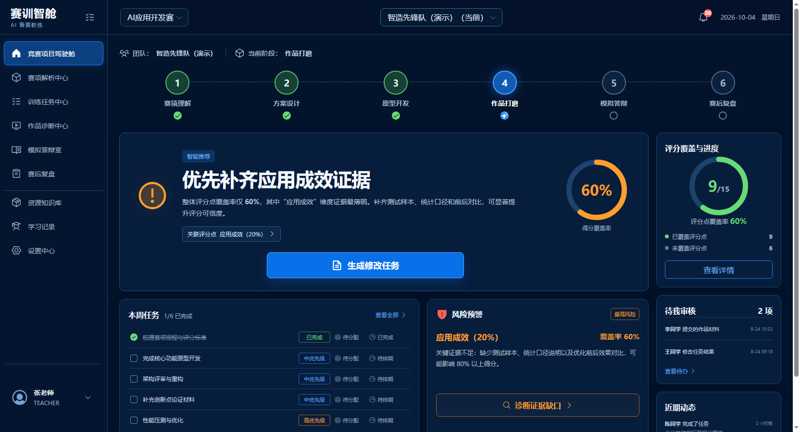
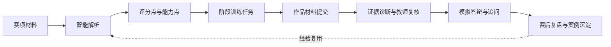
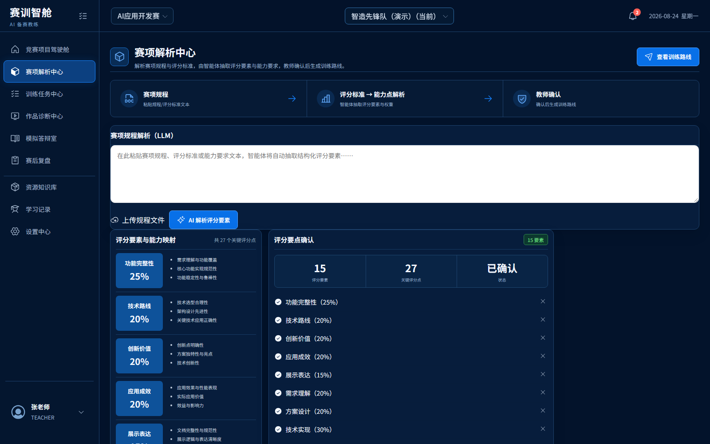
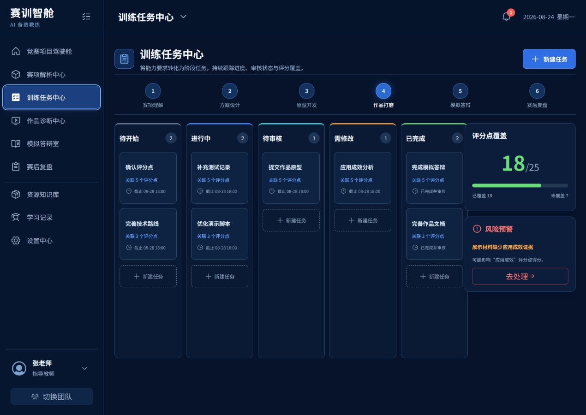
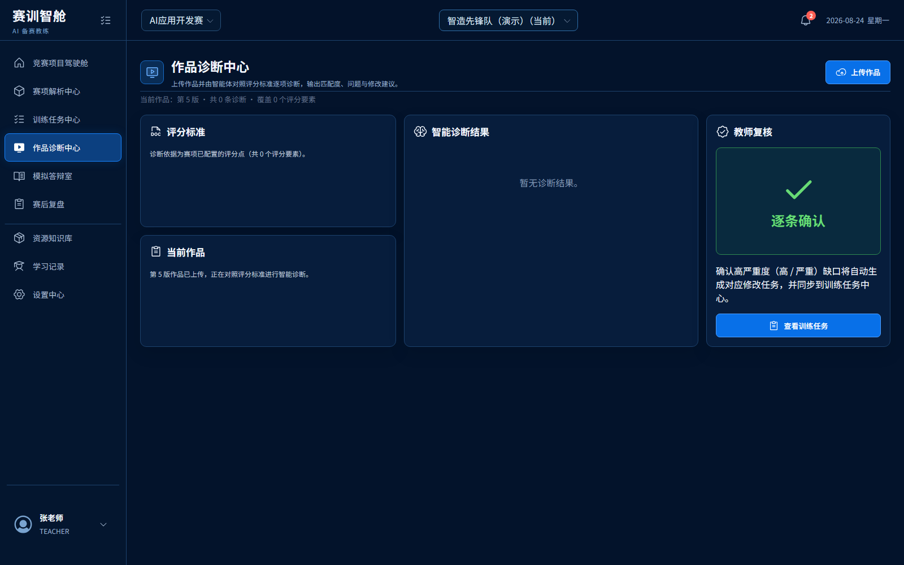
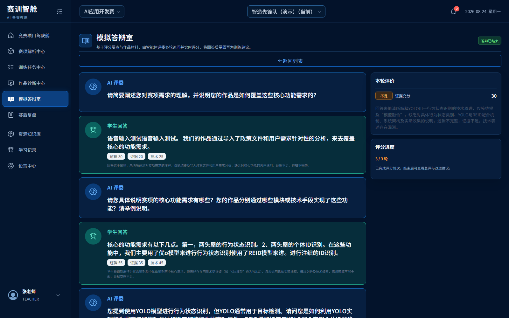
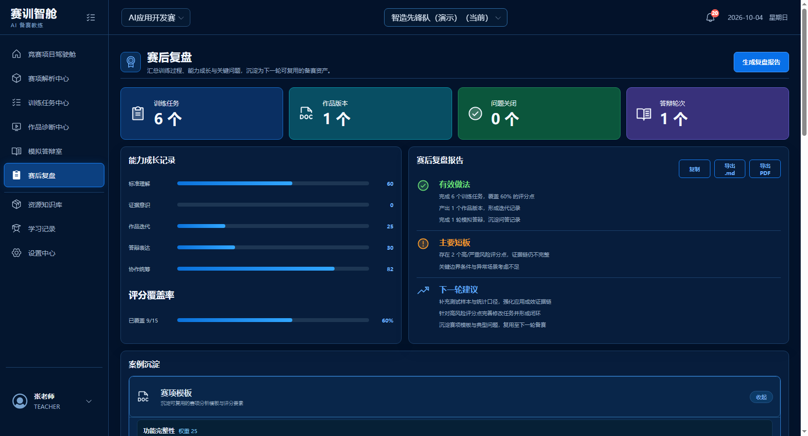

<div align="center">

# 赛训智舱

### AI 驱动的职业技能竞赛备赛教学智能体 Web 原型

围绕评分标准组织任务、诊断作品证据、开展模拟答辩并沉淀赛后经验，让竞赛训练从“经验驱动”走向“标准驱动、证据驱动和持续改进”。

[在线体验](https://liuduanchn.github.io/saixun-web-prototype/) · [GitHub 仓库](https://github.com/liuduanchn/saixun-web-prototype)

</div>



## 项目简介

赛训智舱面向职业技能竞赛中的指导教师与学生团队，聚焦赛项材料复杂、评分点难拆解、团队任务与评价标准脱节、作品修改缺少证据依据、答辩训练随机性强等真实问题，构建覆盖“赛项理解—方案设计—原型开发—作品打磨—模拟答辩—赛后复盘”的智能备赛闭环。

当前仓库为可交互的 Web 前端原型，重点展示三个核心价值：

- 将赛项规程和评分标准转化为结构化能力点与备赛路线；
- 将团队任务、作品材料与评分点绑定，使训练过程可追踪、可审核；
- 从评委视角诊断作品证据，生成修改任务、答辩追问和复盘建议。

## 适用场景

- 职业院校技能竞赛的项目化备赛与过程管理；
- 指导教师开展任务分解、进度督导、作品审核与针对性指导；
- 学生团队进行材料提交、作品迭代、模拟答辩和能力成长记录；
- 赛后将训练数据、典型问题和优秀做法沉淀为下一轮可复用资源。

## 核心业务闭环



## 功能模块

| 模块 | 主要功能 |
| --- | --- |
| 竞赛项目驾驶舱 | 汇总阶段进度、评分覆盖率、本周任务、风险预警、待审核事项与智能建议 |
| 赛项解析中心 | 解析赛项材料，提取评分维度、证据要求和关键能力点，形成备赛路线 |
| 训练任务中心 | 通过阶段看板管理负责人、截止时间、提交物及关联评分点 |
| 作品诊断中心 | 对照评分标准识别证据缺口，给出影响评分与修改建议，并支持教师复核 |
| 模拟答辩室 | 基于项目材料生成评委问题和二次追问，评价回答逻辑、证据与技术准确性 |
| 赛后复盘 | 汇总训练、版本、问题关闭和答辩数据，形成能力成长记录与下一轮建议 |
| 资源知识库 | 统一管理赛项文件、案例、模板和备赛资源 |
| 学习记录 | 记录成员学习活动、阶段成果和能力变化 |
| 设置中心 | 管理演示账号信息、通知偏好与工作区设置 |

## 界面预览

### 项目总览


### 从标准解析到任务推进

| 赛项解析中心 | 训练任务中心 |
| --- | --- |
|  |  |

### 从作品诊断到答辩训练

| 作品诊断中心 | 模拟答辩室 |
| --- | --- |
|  |  |

### 赛后复盘与经验沉淀



## 演示账号

| 账号 | 角色 |
| --- | --- |
| `teacher` | 指导教师 |

演示密码不在公开仓库中展示，请使用项目单独配置的演示凭据。本地运行时需在 `.env.local` 中设置 `VITE_DEMO_PASSWORD_HASH`；GitHub Pages 使用同名构建值对应的仓库变量 `DEMO_PASSWORD_HASH`。

> 当前登录仅用于前端原型演示。密码会在浏览器中计算 SHA-256 后与构建配置比对，但这不能替代服务端身份认证，也不应作为生产环境权限方案。

## 技术栈

- React 19：页面与交互状态构建；
- Vite 6：本地开发与生产构建；
- Phosphor Icons：界面图标；
- Noto Sans SC：中文界面字体；
- Node.js Test Runner：登录、通知、页面映射及托管 Worker 测试。

## 本地运行

建议使用 Node.js 20 LTS 或更高版本。

```bash
npm install
npm run dev
```

开发服务器启动后，按终端输出的地址访问页面。

## 测试与构建

```bash
# 应用状态与交互逻辑测试
npm run test:app

# 静态站点托管 Worker 测试
npm run test:sites

# 生产构建，前端产物位于 dist/client
npm run build
```

## 项目结构

```text
saixun-web-prototype/
├─ docs/readme-assets/       # README 界面截图
├─ public/assets/            # 静态图片资源
├─ scripts/                  # 构建与站点准备脚本
├─ src/
│  ├─ App.jsx                # 应用外壳、导航与通知交互
│  ├─ LoginScreen.jsx        # 演示登录页
│  ├─ appState.js            # 登录、通知与页面映射状态逻辑
│  ├─ pages.jsx              # 各业务页面
│  └─ styles.css             # 全局响应式样式
├─ tests/                    # Node 测试
├─ worker/index.js           # 静态站点 SPA 回退 Worker
├─ package.json
└─ vite.config.mjs
```

## GitHub Pages 部署说明

项目已配置 GitHub Pages，可通过 [在线演示地址](https://liuduanchn.github.io/saixun-web-prototype/) 访问。每次向 `main` 分支推送代码时，GitHub Actions 会自动运行测试、构建项目并发布 `dist/client` 目录。

当前 Vite `base` 为 `/saixun-web-prototype/`，与项目仓库型 Pages 地址匹配。仓库改为自定义域名或根域名部署时，应同步将 `base` 调整为 `/`。

## 当前范围

本项目是教学智能体大赛场景下的前端交互原型，当前数据为演示数据，暂未接入真实后端、文件解析模型、数据库与生产级权限系统。后续可在现有信息架构上逐步接入赛项文档解析、智能诊断、语音答辩与学习分析服务。

## 许可说明

本项目目前未声明开源许可证。未经许可，请勿将代码用于商业用途。
