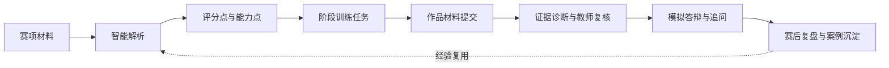
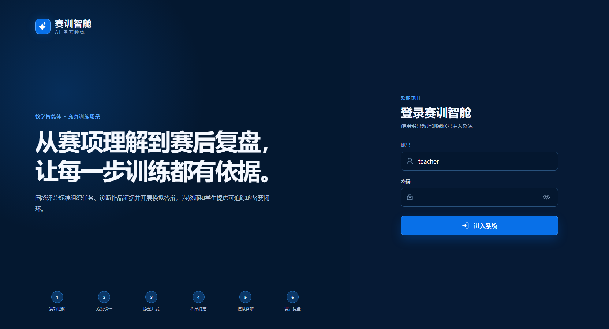
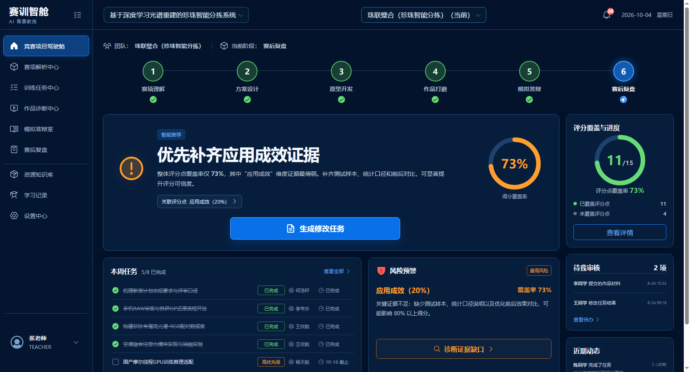
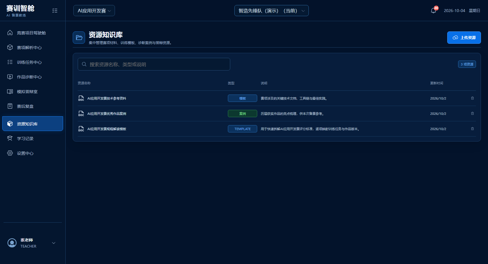
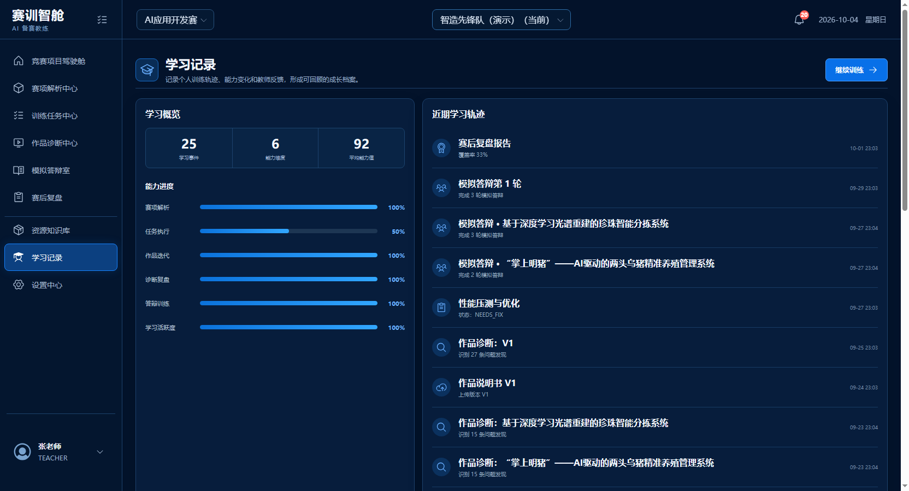
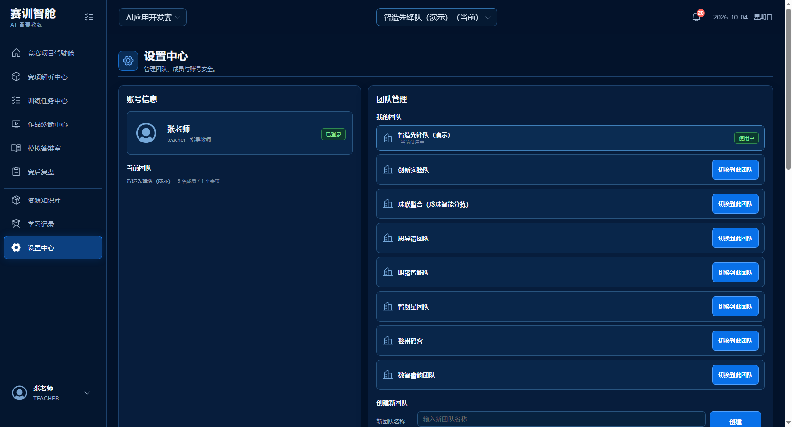
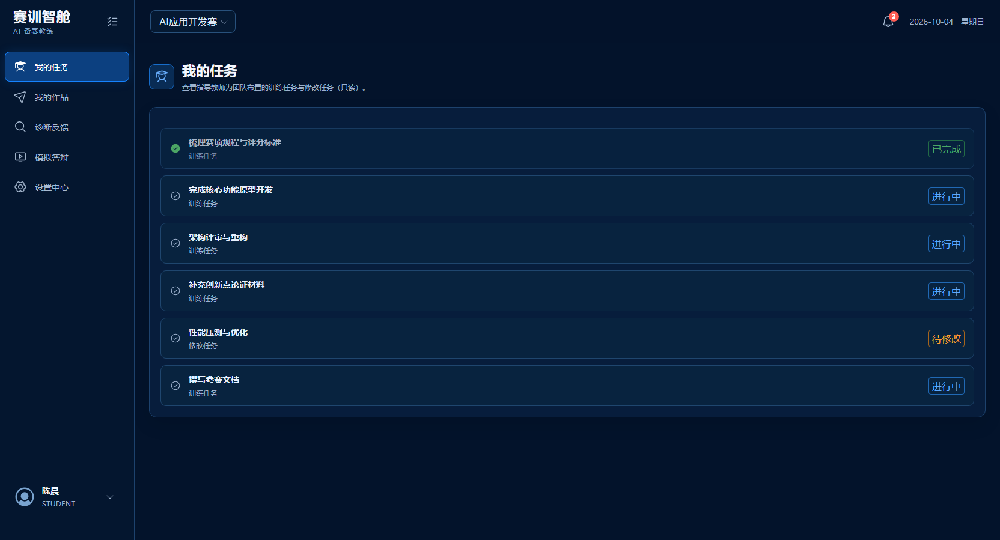
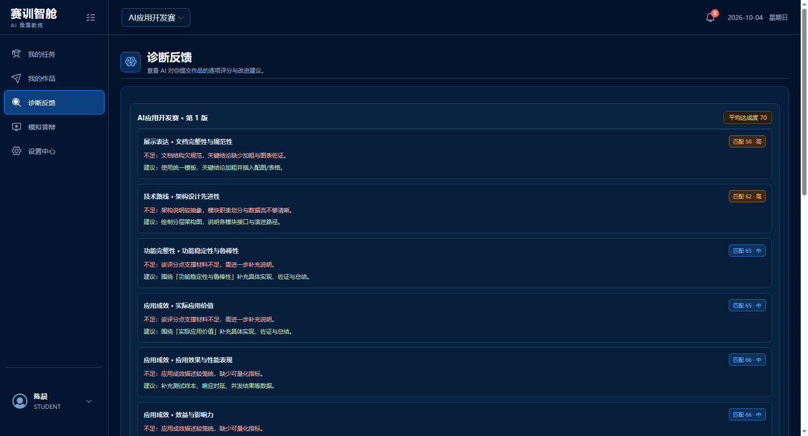
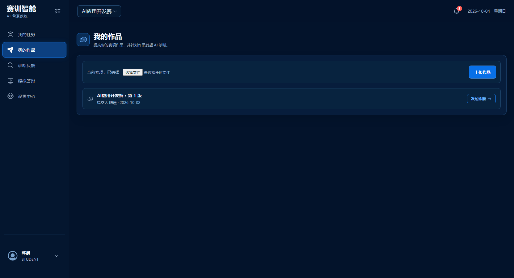
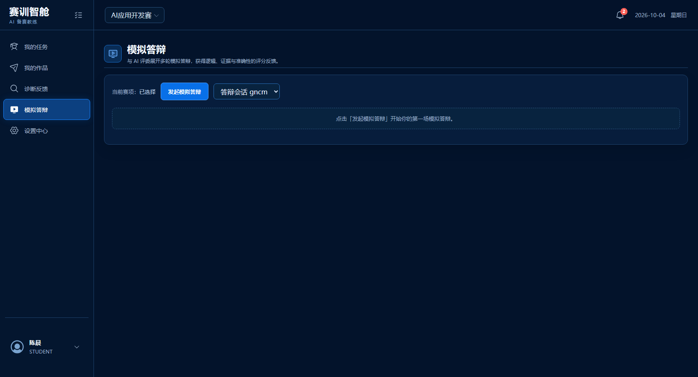

<div align="center">

# 赛训智舱

### AI 驱动的职业技能竞赛备赛教学智能体

围绕评分标准组织任务、诊断作品证据、开展模拟答辩并沉淀赛后经验，让竞赛训练从“经验驱动”走向“标准驱动、证据驱动和持续改进”。

[在线体验](https://saixun-cabin.app.workbuddy.host/) · [GitHub 仓库](https://github.com/liuduanchn/saixun-web-prototype)

</div>


## 项目简介

赛训智舱面向职业技能竞赛中的指导教师与学生团队，聚焦赛项材料复杂、评分点难拆解、团队任务与评价标准脱节、作品修改缺少证据依据、答辩训练随机性强等真实问题，构建覆盖“赛项理解—方案设计—原型开发—作品打磨—模拟答辩—赛后复盘”的智能备赛闭环。

当前仓库为**前后端一体的可运行系统**（非静态原型），内置 8 个团队、10 个赛项项目的差异化演示数据，重点展示三个核心价值：

- 将赛项规程和评分标准转化为结构化能力点与备赛路线；
- 将团队任务、作品材料与评分点绑定，使训练过程可追踪、可审核；
- 从评委视角诊断作品证据，生成修改任务、答辩追问和复盘建议。

## 适用场景

- 职业院校技能竞赛的项目化备赛与过程管理；
- 指导教师开展任务分解、进度督导、作品审核与针对性指导；
- 学生团队进行材料提交、作品迭代、模拟答辩和能力成长记录；
- 赛后将训练数据、典型问题和优秀做法沉淀为下一轮可复用资源。

## 核心业务闭环



## 功能模块

| 模块 | 主要功能 |
| --- | --- |
| 竞赛项目驾驶舱 | 汇总阶段进度、评分覆盖率、本周任务、风险预警、待审核事项与智能建议 |
| 赛项解析中心 | 解析赛项材料，提取评分维度、证据要求和关键能力点，形成备赛路线 |
| 训练任务中心 | 通过五态看板管理负责人、截止时间、提交物及关联评分点 |
| 作品诊断中心 | 对照评分标准识别证据缺口，给出影响评分与修改建议，并支持教师复核 |
| 模拟答辩室 | 基于项目材料生成评委问题和二次追问，评价回答逻辑、证据与技术准确性 |
| 赛后复盘 | 汇总训练、版本、问题关闭和答辩数据，形成能力成长记录与下一轮建议 |
| 资源知识库 | 统一管理赛项文件、案例、模板和备赛资源 |
| 学习记录 | 记录成员学习活动、阶段成果和能力变化 |
| 设置中心 | 管理团队、成员、ASR 语音识别配置与账号安全 |

## 界面预览

### 登录



### 项目总览


### 多团队差异化

同一账号可切换 8 个团队，各团队的项目阶段、任务分布、评分覆盖率与答辩进度**各不相同**（下图为「珠联璧合（珍珠智能分拣）」，阶段为「赛后复盘」、覆盖率 73%，对比上图「智造先锋队」的「作品打磨」、60%）：



### 从标准解析到任务推进

| 赛项解析中心 | 训练任务中心 |
| --- | --- |
|  |  |

### 从作品诊断到答辩训练

| 作品诊断中心 | 模拟答辩室 |
| --- | --- |
|  |  |

### 复盘、资源与设置

| 赛后复盘 | 资源知识库 |
| --- | --- |
|  |  |

| 学习记录 | 设置中心 |
| --- | --- |
|  |  |

### 学生端

学生登录后落地「我的任务」，界面与权限按角色收敛。

| 我的任务 | 诊断反馈 |
| --- | --- |
|  |  |

| 我的作品 | 模拟答辩 |
| --- | --- |
|  |  |

## 演示账号

密码统一为 `123456`。

| 账号 | 角色 | 所属团队 |
| --- | --- | --- |
| `teacher` | 指导教师 | `智造先锋队（演示）`，可切换至全部 8 个团队 |
| `student1` | 学生（陈晨） | `demo-tenant` |
| `student2` | 学生 | `创新实验队` |
| `pearl_teacher` / `sidaopu_teacher` / `mingzhu_teacher` / `zhihuaxing_teacher` / `yihuoji_teacher` / `sheyun_teacher` | 指导教师 | 对应 6 个实例项目团队 |

演示数据规模：**10 租户 / 11 赛项项目 / 41 账号**（`seed.ts` 贡献 3 团队，`seed-instance-projects.ts` 贡献 6 团队 27 账号）。

登录走后端 JWT 鉴权（`/api/auth/login`，支持刷新令牌续期与登出吊销）。未连接后端时自动进入 `DEMO_MODE`，展示内置示例数据，此时登录不可用。

## 技术栈

- React 19 + Vite 6：页面与交互状态；
- NestJS 11 + Prisma 6：真实鉴权、多租户隔离与业务数据（SQLite；早期版本曾用 PostgreSQL）；
- Phosphor Icons：界面图标；
- OpenAI 兼容协议：赛项解析、作品诊断、模拟答辩的模型调用（兼容 OpenAI / DeepSeek / 硅基流动 / 通义等）；
- Node.js Test Runner：分页解包、日期格式化、阶段映射、会话与通知等逻辑测试。

## 大模型配置

模型调用采用 OpenAI 兼容协议，兼容 OpenAI / DeepSeek / 硅基流动 / 通义等供应商——
切换供应商只需改 `AI_BASE_URL` 与 `AI_MODEL`，不改业务代码。

配置采用三级优先级：

| 优先级 | 来源 | 说明 |
| --- | --- | --- |
| 1 | 运行时环境变量 `AI_BASE_URL` / `AI_API_KEY` / `AI_MODEL` | 常规平台做法 |
| 2 | `server/config/runtime.json`（未入库，仓库仅提交 `.example.json`） | 本地或自建部署 |
| 3 | 缺省 | 自动降级为**确定性启发式**，功能闭环仍完整 |

密钥绝不下发前端；日志与错误信息中的 Key 一律脱敏。

> **即将调整**：当前是「全局单模型」配置，界面尚无模型设置入口。
> 后续将改为**按团队配置 Base URL / API Key / 模型名称**（含分功能模型覆盖与功能开关），
> 方案见 [大模型配置租户化方案](大模型配置租户化方案-20261004.md)。
> 本节描述的是当前实现，接口与配置方式届时会变化。

```bash
# 查看当前生效配置（只返回是否配置、模型名、接入域名、来源）
curl http://localhost:17100/api/config/status
```

> **未配置模型时**，赛项解析 / 作品诊断 / 模拟答辩会自动回退到内置启发式实现：
> 数据照常落库、流程完整可演示，但输出为固定模板而非真实模型推理。
> 详见 [AI 调用链路分析](AI调用链路分析-20261004.md)。

## 本地运行

建议使用 Node.js 20 LTS 或更高版本（实测 22.x 可用）。

### 端口约定（重要）

| 项 | 值 | 说明 |
| --- | --- | --- |
| 前端 | **17200** | Vite 开发端口，启动时用 `--port` 指定 |
| 后端 | **17100** | `server/.env` 的 `PORT`，须与前端 `VITE_PROXY_TARGET`一致 |
| 端口选择 | ⚠️ | Windows 动态保留段每次开机都会变化（本机当前最高排除段到 14280）。绑定报 `EACCES` 时先执行 `netsh interface ipv4 show excludedportrange protocol=tcp`（务必看完整列表），改用排除段之外的端口 |

### 全栈本地运行（前端 + 后端 + 数据库）

**步骤**

```bash
# 1. 后端依赖 + 数据库初始化（SQLite，无需外部数据库服务）
cd server
npm install
npx prisma generate
npx prisma migrate deploy      # 首次会创建 server/prisma/saixun.db
npm run prisma:seed            # 灌入演示数据（10 租户 / 11 项目 / 41 账号）
npm run prisma:seed:instances  # 追加 6 个实例项目团队的差异化数据

# 2. 启动后端（读取 server/.env 的 PORT，当前为 17100）
npx nest build && node dist/main
# 健康检查：curl http://127.0.0.1:17100/api/health → {"status":"ok","db":"up"}
# 注意：nest build 的清目录步骤可能被安全钩子拦截，此时改用：
#   npx tsc -p tsconfig.build.json --outDir dist2 && cp -r dist2/. dist/

# 3. 另开终端启动前端（:17200），并把代理目标同步到后端端口
cd ..
VITE_PROXY_TARGET=http://127.0.0.1:17100 npx vite --port 17200
# 访问 http://127.0.0.1:17200/saixun-web-prototype/
```

> ⚠️ **Vite 的 `base` 默认为 `/saixun-web-prototype/`**（GitHub Pages 子路径部署），
> 本地访问也必须带这个前缀，否则页面会空白。
> `.env.local` 中 `VITE_API_BASE=/api`，由 Vite 代理转发到后端。

> 跨域：后端默认放行常见开发端口；若改用其他端口，需在 `server/.env` 加
> `CORS_ORIGINS=http://localhost:<port>` 后重启后端。

### 仅前端（演示模式，无需后端）

```bash
npm install
npm run dev
```

未配置 `VITE_API_BASE` 时自动进入 `DEMO_MODE`，展示内置示例数据（此时登录不可用）。

## 测试与构建

```bash
# 应用状态、分页解包、日期与阶段映射等逻辑测试
npm run test:app

# 页面构建产物测试（会先执行 build）
npm run test:pages

# 静态站点托管 Worker 测试
npm run test:sites

# 生产构建，前端产物位于 dist/client
npm run build
```

## 项目结构

```text
saixun-web-prototype/
├─ docs/readme-assets/       # README 界面截图
├─ public/assets/            # 静态图片资源
├─ scripts/                  # 构建、站点准备与 WorkBuddy 发布脚本
├─ src/
│  ├─ App.jsx                # 应用外壳、导航、通知与驾驶舱
│  ├─ LoginScreen.jsx        # 登录页（后端 JWT 鉴权）
│  ├─ WorkspacePage 路由      # 见 pages.jsx 导出
│  ├─ api.js                 # 后端 API 客户端（令牌管理与请求封装）
│  ├─ appState.js            # 会话、通知与页面映射状态逻辑
│  ├─ shape.js               # 分页解包、日期格式化、阶段映射
│  ├─ taskModel.js           # 任务状态机与展示模型转换
│  ├─ ProgressRing.jsx       # 内联 SVG 进度环
│  ├─ pages.jsx              # 教师端业务页面
│  ├─ studentPages.jsx       # 学生端页面
│  ├─ audio.js               # 录音转码（语音答辩共用）
│  └─ styles.css             # 全局深色主题样式
├─ server/                   # NestJS + Prisma 后端
│  ├─ src/ai/                # OpenAI 兼容调用实现
│  ├─ src/config/            # AI 三级配置与状态接口
│  └─ prisma/                # schema 与种子脚本
├─ tests/                    # Node 测试
├─ worker/index.js           # 静态站点 SPA 回退 Worker
├─ package.json
└─ vite.config.mjs
```

## 部署说明

当前默认分支 `main` 采用 **SQLite + 单端口自包含**形态（NestJS 同时托管前端与 API），
可直接部署到 WorkBuddy 托管平台：

| 目标 | 说明 |
| --- | --- |
| **WorkBuddy 托管**（当前 `main`） | 入口 `https://saixun-cabin.app.workbuddy.host/`，执行 `npm run workbuddy:install` + `npm run workbuddy:start`，详见 [WORKBUDDY_DEPLOY.md](WORKBUDDY_DEPLOY.md) |
| GitHub Pages | `base` 为 `/saixun-web-prototype/`；CI 需 `DATABASE_URL` 为 SQLite 路径才能构建，详见 [DEPLOYMENT.md](DEPLOYMENT.md) |

> **数据层历史说明**：本项目早期 `main` 使用 PostgreSQL + Railway/GitHub Pages 链路，
> 2026-10-04 起 `main` 已快进到部署分支，统一为 SQLite 形态。
> 若需恢复 PostgreSQL 链路，请从提交 `428ae57`（`feat(data): 实例项目示例数据脚本…`）分支出去。
> `server/prisma/schema.prisma` 中 `provider = "sqlite"` 是该形态的标志。

## 当前范围

已具备：JWT 鉴权与刷新令牌续期、多租户数据隔离（8 团队 / 11 项目演示数据）、团队切换与项目级数据隔离、文件上传大小与类型限制、列表分页（统一 `{items,total,page,pageSize}` 结构）、检索增强（基于全文检索的案例沉淀库）、通知事件驱动与学习埋点、语音答辩（ASR 可在设置中心配置）。

近期修复记录见 [问题排查清单](问题排查清单-20261003.md)（15 项界面与数据问题）。

后续可进一步完善：向量检索（当前为关键词全文检索）、AI 能力配置界面（方案已设计，见 [大模型配置租户化方案](大模型配置租户化方案-20261004.md)）、设置接口的角色权限校验、前端 E2E 测试、API 文档（Swagger）与线上监控。

## 许可说明

本项目目前未声明开源许可证。未经许可，请勿将代码用于商业用途。

