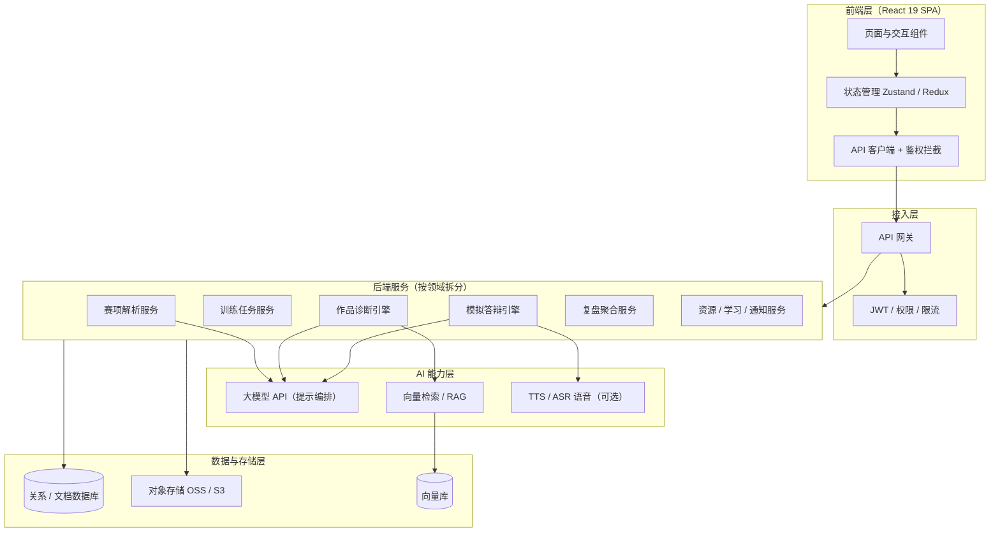

# 赛训智舱 Web 原型 — 真实化开发路线图

> 本文档基于 `saixun-web-prototype` 当前代码（纯前端 SPA、全量写死 mock 数据、无后端 / 数据库 / AI 调用）梳理。
> 目标：将"演示壳"升级为"带后端 + 数据与 AI 真实接入"的可上线系统。
> 生成日期：2026-08-25

---

## 一、当前状态总览

| 维度 | 当前实现 | 真实可用所需 |
| --- | --- | --- |
| 鉴权 | 1 个写死账号 `teacher/123456`，浏览器内 SHA-256 比对 | 真实注册/登录、角色、多租户 |
| 数据 | 全部硬编码常量（`stages`/`tasks`/`criteria`/`board`/`resources`…） | 数据库持久化 + API |
| 存储 | 无；"上传"仅为 toast 提示 | 对象存储 + 版本管理 |
| AI | 无；诊断 92%、答辩对话、复盘指标全部写死 | LLM / RAG 真实调用 |
| 部署 | GitHub Pages 仅托管静态前端 | 独立后端服务（Pages 无法运行 API） |

**核心结论**：当前最大的拦路石是**缺少后端与部署架构**，必须先补齐地基，所有业务模块的"真实化"才能落地。

---

## 二、目标架构图

**架构要点说明**
- 前端保留现有 React 外壳与深蓝视觉体系，仅将"写死常量"替换为 API 调用 + 客户端状态管理。
- 后端建议按业务域拆分为独立服务（或单体分层模块），统一经 API 网关与鉴权。
- AI 能力集中为独立层，便于切换模型供应商、控制成本与做评测。
- 数据层区分"业务数据库"与"向量库"，作品/赛项材料入对象存储，证据匹配走 RAG。

---

## 三、详细开发清单

### A. 后端与基础设施（地基，必须最先做）
- [ ] 技术栈与脚手架：选后端（Node/Python）+ 数据库（Postgres / MongoDB）
- [ ] 数据库 Schema：用户、团队/项目、赛项、评分标准、评分点、任务、作品版本、诊断记录、答辩记录、资源、学习事件、通知
- [ ] API 层：REST / GraphQL，含鉴权中间件
- [ ] 鉴权与权限：注册、JWT / Session、角色（教师/学生）、密码安全、多租户隔离
- [ ] 文件存储：上传/下载/版本（OSS / S3 / CloudBase），格式校验与病毒扫描
- [ ] 部署架构：容器化 + CI/CD；**注意 GitHub Pages 无法托管后端**，需独立 API 域名（云函数 / 容器 / CloudBase）
- [ ] 前端改造：把 `src` 内所有写死常量改为 API 调用，引入状态管理 + 乐观更新

### B. 赛项解析中心（当前 `criteria`/`board` 写死，"4 份已解析"为假）
- [ ] 文档解析服务：Word / PDF / Excel / PPT 文本抽取
- [ ] LLM 结构化抽取：从规程/评分标准生成评分维度、权重、能力点
- [ ] 评分点—能力点—任务映射的存储与教师编辑
- [ ] 教师"确认 / 驳回"工作流写回

### C. 训练任务中心（当前 `board`/`initialTasks` 写死，刷新即丢失）
- [ ] 任务 CRUD + 关联评分点 / 负责人 / 截止时间
- [ ] 看板状态流转（拖拽）、多人协作
- [ ] 学生提交 → 教师审核流
- [ ] 评分覆盖率**实时计算**（基于真实任务-评分点关联，替换写死的 18/25）

### D. 作品诊断中心（当前 92% 匹配、"严重"、"待确认"全写死）
- [ ] 作品材料真实上传与存储
- [ ] 诊断引擎：作品内容 vs 评分标准做证据匹配（LLM / RAG），输出真实缺口 / 影响 / 建议
- [ ] 教师复核（确认 / 驳回）写回并**真实生成修改任务**到任务中心
- [ ] 首页"生成修改任务"目前仅本会话有效，需持久化

### E. 模拟答辩室（当前对话、评分、追问全部写死）
- [ ] LLM 评委：基于项目材料**真实生成**追问（替换写死的 3 条对话）
- [ ] 学生作答采集（文本输入；进阶：语音转写）
- [ ] 回答自动评价（逻辑 / 证据 / 技术准确性）写回
- [ ] 教师补充评价持久化
- [ ] 进阶：TTS / ASR 实时语音答辩

### F. 赛后复盘（当前任务数 / 版本数 / 能力分全写死）
- [ ] 从真实训练 / 版本 / 诊断 / 答辩数据**聚合**复盘指标（替换 12 个任务、3 个版本）
- [ ] 能力成长分基于真实记录计算
- [ ] 案例沉淀库真实存储与检索

### G. 资源知识库（当前 `resources` 数组 + 前端过滤，无上传）
- [ ] 真实上传、分类、标签、全文检索
- [ ] 团队内共享权限

### H. 学习记录（当前 timeline / metrics 写死）
- [ ] 真实活动埋点（登录、提交、诊断、答辩、完成任务）
- [ ] 个人成长档案聚合

### I. 通知中心（当前 `initialNotifications` 写死，刷新丢失）
- [ ] 事件驱动通知（提交 / 审核 / 风险 / 到期触发）
- [ ] 未读 / 已读真实持久化
- [ ] 对接设置中心偏好开关（当前开关只是本地 state，无效）

### J. 跨模块能力
- [ ] 多团队 / 多项目 / 多赛项切换（当前"切换团队"只是 toast）
- [ ] 权限分级（教师可审核，学生受限操作）
- [ ] 所有"生成"按钮（训练路线 / 修改任务 / 复盘报告）真实接入后端 + AI 并持久化

### K. 质量与安全合规
- [ ] 后端单元测试 + 前端 E2E
- [ ] 安全：XSS / CSRF、上传校验、鉴权加固
- [ ] 隐私与数据合规（学生数据、模型调用合规）

---

## 四、各模块工作量估算

> 单位：人日（按 1 名全栈 + 1 名 AI/算法工程师的中等水平估算，含联调联试余量）。
> 估算为订单级，用于排期参考，非精确报价。

| 模块 | 关键交付 | 估时（人日） | 依赖 |
| --- | --- | --- | --- |
| A 后端基础设施 | 脚手架 / DB Schema / 鉴权 / 文件存储 / 部署 | 18 | 无 |
| B 赛项解析 | 文档解析 + LLM 抽取 + 映射编辑 | 10 | A |
| C 训练任务 | CRUD / 看板 / 审核流 / 覆盖率计算 | 9 | A |
| D 作品诊断 | 上传 + 诊断引擎（RAG） + 复核写回 | 12 | A, B |
| E 模拟答辩 | LLM 追问 + 作答 + 评价 + 语音（可选） | 12 | A, D |
| F 赛后复盘 | 数据聚合 + 能力成长 + 案例库 | 7 | A, C, D, E |
| G 资源知识库 | 上传 / 检索 / 权限 | 6 | A |
| H 学习记录 | 埋点 + 成长档案 | 5 | A |
| I 通知中心 | 事件驱动 + 持久化 + 偏好 | 5 | A, C, D |
| J 跨模块 / 多租户 | 多团队切换 + 权限分级 | 10 | A 之后各模块 |
| K 质量安全合规 | 测试 / E2E / 安全 / 合规 | 8 | 各模块 |
| **合计** | | **≈ 102** | |

---

## 五、建议实施阶段与排期

| 阶段 | 范围 | 估时（3 人并行：后端+前端+AI） |
| --- | --- | --- |
| Phase 0 | A 全量（后端 + DB + 鉴权 + 部署） | 第 1–3 周 |
| Phase 1 | C 任务持久化 + D 诊断真实化 | 第 3–6 周 |
| Phase 2 | B 赛项解析 LLM + E 答辩 LLM | 第 6–9 周 |
| Phase 3 | F / G / H / I + J 多租户 | 第 9–12 周 |
| Phase 4 | K 安全合规 + 上线打磨 | 第 12–14 周 |

**团队配置建议**
- 最小可行：1 后端 + 1 前端 + 1 AI/算法（共 3 人），约 **14 周（约 3.5 个月）** 完成全部清单。
- 精简版（仅 Phase 0–2 跑通核心闭环）：约 **9 周**，可先以"教师视角可真实管理一个赛项"作为首个可验收里程碑。

**首个可验收里程碑建议**：Phase 0 + C + D 完成后，教师可真实完成「上传赛项 → 建任务 → 上传作品 → AI 诊断出证据缺口 → 生成修改任务 → 任务闭环」，即当前原型演示的核心故事线变为真实可用。

---

## 六、关键风险与决策点

1. **后端托管方案**：Pages 静态托管无法运行 API，需尽早确定（云函数 / 容器 / CloudBase / 自建服务器）。
2. **模型供应商与成本**：LLM 调用频次高（解析、诊断、答辩），需做缓存、批处理与评测，避免成本失控。
3. **RAG 质量**：作品诊断的可信度依赖证据匹配质量，需准备评测集与人工抽检机制。
4. **多租户隔离**：学生数据、赛项材料涉及隐私，权限与数据隔离需在 A 阶段就设计到位。
5. **现有前端改造面**：`src` 中写死常量分散在 `App.jsx` 与 `pages.jsx`，建议以"先抽数据层、再接 API"的方式渐进改造，保留现有视觉与交互。
